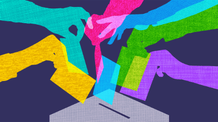

# 📪 Prior to Artifiocracy

There have been many different political systems before democracy, such as monarchy, oligarchy, aristocracy, tyranny, republicanism, etc \[10, 11, 12]. These systems vary in how they distribute power and authority among different groups or individuals in society. Some of them are more centralized and hierarchical, while others are more decentralized and participatory.

Some of the political systems prior to or competitors to democracy are \[14, 15, 16]:

* **Communism:** A system where all property and resources are owned by a single party or state that controls all aspects of economic and social life.
* **Socialism:** A system where some property and resources are owned by a collective or state that regulates some aspects of economic and social life.
* **Oligarchy:** A system where power and authority are held by a small group or elite that dominates most aspects of political and social life.
* **Monarchy:** A system where power and authority are inherited by a single person who rules as a king or queen over most aspects of political and social life.
* **Theocracy:** A system where power and authority are derived from a divine or religious source that guides most aspects of political and social life.
* **Colonialism:** A system where power and authority are imposed by a foreign or external force that exploits most aspects of political and social life.
* **Totalitarianism:** A system where power and authority are concentrated in a single leader or party that controls all aspects of political and social life.

**Democracy** is popular among communities because it offers some benefits that other systems may not have \[1, 13]. For example,

* Democracy respects human dignity and freedom by allowing people to have a say and a choice in how they are governed.
* Democracy promotes diversity and pluralism by respecting different opinions and interests in society.
* Democracy fosters development and innovation by encouraging participation, cooperation, and competition among various actors in society.
* Democracy enhances stability and peace by preventing violence, conflict, or oppression among different groups or individuals in society.

These are some of the reasons why democracy is considered the best system so far by many people. However, democracy is not perfect or flawless and it faces many challenges or problems in different contexts. Let us dive in deeper to expand the topic of democracy.&#x20;

## Democracy

**Democracy** is a system of government where the people have the power to make decisions about how their country or community is run \[1]. They can do this either directly by voting on issues themselves, or indirectly by electing representatives who act on their behalf. Democracy is based on the principles of freedom and equality, meaning that everyone has equal rights and opportunities under the law.  There are different types of democracy, such as direct democracy, representative democracy, constitutional democracy, etc. Each one has its own advantages and disadvantages in theory.

<figure><figcaption>
<em>Img Ref:</em>  <a href="https://www.javatpoint.com/advantages-and-disadvantages-of-democracy">https://www.javatpoint.com/advantages-and-disadvantages-of-democracy</a>
</figcaption></figure>

### Advantages (in Theory :smile:) of Democracy&#x20;

Some of the advantages of democracy compared to other systems can be listed as follows \[2,3,4,5,6] ;

* It protects the interest of citizens by giving them a voice and a choice in how they are governed. For example, in a democracy, people can vote for their preferred candidates and policies in elections, or express their opinions through protests, petitions, or media outlets.
* It prevents monopoly of authority by distributing power among different branches and levels of government, and by holding leaders accountable to the people through elections and checks and balances. For example, in a democracy, there is usually a separation of powers between the executive, legislative, and judicial branches of government, which prevents any one branch from becoming too powerful or abusive. Also, leaders who fail to perform well or act corruptly can be removed from office by impeachment, recall, or vote of no confidence.
* It promotes equality by respecting human rights and ensuring equal protection under the law for everyone regardless of their race, gender, religion, etc. For example, in a democracy, people have basic rights such as freedom of speech, religion, assembly, movement etc., which allow them to express themselves freely and pursue their interests without fear of persecution. Also, people have equal access to education, healthcare, justice, and other public services that improve their quality of life.
* It makes for a responsible and stable administration by encouraging participation, cooperation, compromise, and consensus among different groups and interests in society. For example, in a democracy, people can form civil society organizations, political parties, interest groups etc., which represent their views and needs to the government and influence policy-making. Also, the government has to consult with various stakeholders and seek public approval before implementing major decisions that affect society.
* It imparts political education to the people by fostering civic awareness, engagement, and responsibility among citizens. For example, in a democracy, people learn about their rights and duties as citizens through formal education, media exposure, or civic activities. Also, people develop critical thinking skills, tolerance, and respect for diverse opinions by engaging in political discussions and debates with others.&#x20;

### Disadvantages of Democracy&#x20;

Some of the disadvantages of democracy compared to other systems can be listed as follows \[2, 5, 6, 7, 8, 9]&#x20;

* It might allow misuse of public funds and time by politicians or bureaucrats who waste resources on unnecessary or inefficient projects, programs, or activities. For example, in a democracy, there may be cases of pork-barrel spending, where government officials allocate funds to specific districts or regions for political gain rather than public benefit.
* It instigates corruption by creating opportunities for bribery, nepotism, patronage, or fraud among public officials who abuse their power or position for personal gain. For example, in a democracy, there may be instances of vote-buying, where candidates or parties offer money or favors to voters in exchange for their support.
* It risks the wrong choice of public servants by relying on popular opinion rather than merit or competence in selecting leaders or representatives. For example, in a democracy, there may be situations where charismatic or populist candidates or parties appeal to the emotions or prejudices of voters rather than rationality or facts.
* It allows not exercising the right to vote by permitting apathy, ignorance, or indifference among citizens who do not participate in elections or civic affairs. For example, in a democracy, there may be problems of low voter turnout, where many eligible voters do not cast their ballots due to a lack of interest, information, or motivation.
* It may put more emphasis on quantity rather than quality in terms of services by prioritizing majority preferences over minority needs or interests. For example, in a democracy, there may be issues of the tyranny of the majority, where the dominant group imposes its will on the minority group without regard for their rights or welfare.

### Challenges of Democracy

These are some cases in a democracy that make it challenging or problematic to execute a democracy \[17, 18, 19, 20].

* **Corruption and inefficiency:** This refers to the dishonesty or incompetence of political leaders or officials who misuse public funds or resources for personal gain or partisan interests. For example, some politicians may accept bribes, embezzle money, rig elections, or favor their cronies over merit.
* **Role of anti-social elements:** This refers to the influence or interference of criminal groups or violent actors who threaten or harm democratic institutions or processes. For example, some gangs, militias, terrorists, or extremists may intimidate voters, attack candidates, disrupt rallies, or sabotage infrastructure.
* **Growing economic and social inequalities:** This refers to the widening gap between rich and poor people or groups in terms of income, wealth, education, health, or opportunities. For example, some people or groups may face poverty, hunger, illiteracy, disease, or discrimination due to their class, race, gender, or religion.
* **Casteism and communalism:** This refers to the division or conflict among people or groups based on their caste, ethnicity, language, or culture. For example, some people or groups may practice untouchability, segregation, exclusion, or violence against others who belong to different castes or communities.

#### References

1. brittanica.com
2. greengarageblog.org
3. helpfulprofessor.com
4. newculturalfrontiers.org
5. futureofworking.com
6. connectusfund.org
7. educba.com&#x20;
8. vittana.org
9. apecsec.org
10. encyclopedia.com
11. history.com
12. en.wikipedia.org
13. ourworldindata.org
14. unodc.org&#x20;
15. bbc.com
16. pewresearch.org
17. toppr.com
18. scholar.harvard.edu
19. nytimes.com
20. washingtonpost.com

    \
